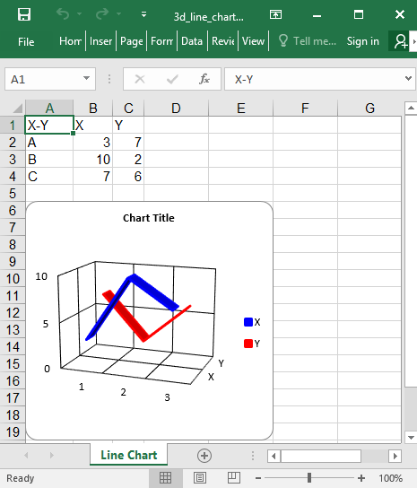

## Description

Line chart example

## Code

```ruby
require 'axlsx'

p = Axlsx::Package.new
wb = p.workbook

wb.add_worksheet(name: 'Line Chart') do |sheet|
  sheet.add_row ['X-Y', 'X', 'Y']

  sheet.add_row ['A', 3, 7]
  sheet.add_row ['B', 10, 2]
  sheet.add_row ['C', 7, 6]

  sheet.add_chart(Axlsx::Line3DChart, start_at: 'A6', end_at: 'F20') do |chart|
    chart.add_series data: sheet["B2:B4"], title: sheet['B1'], color: '0000FF'
    chart.add_series data: sheet["C2:C4"], title: sheet['C1'], color: 'FF0000'
  end
end

p.serialize '3d_line_chart_example.xlsx'
```

## Output


