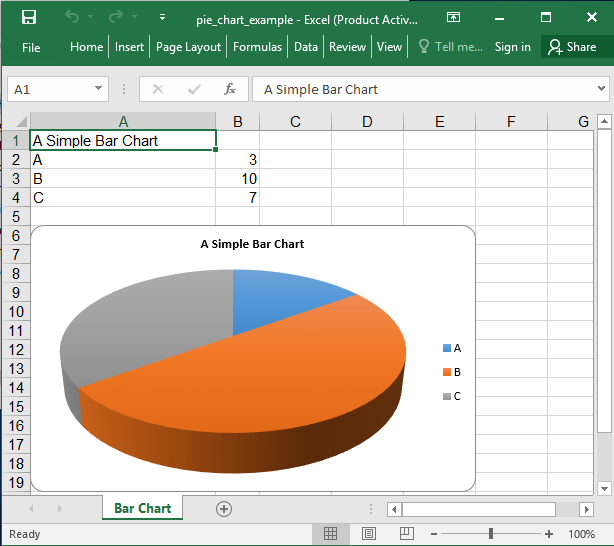

## Description

3D Pie chart example

## Code

```ruby
require 'axlsx'

p = Axlsx::Package.new
wb = p.workbook

wb.add_worksheet(name: 'Pie Chart') do |sheet|
  sheet.add_row ['A Simple Bar Chart']

  sheet.add_row ['A', 3]
  sheet.add_row ['B', 10]
  sheet.add_row ['C', 7]

  sheet.add_chart(Axlsx::Pie3DChart, start_at: 'A6', end_at: 'F20') do |chart|
    chart.add_series data: sheet['B2:B4'], labels: sheet['A2:A4'], title: sheet['A1']
  end
end

p.serialize '3d_pie_chart_example.xlsx'
```

## Output


