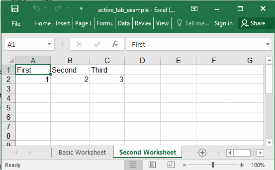

## Description

Book views let you specify which sheet will be shown as active when the user opens the workbook, as well as several other options.

## Code

```ruby
require 'axlsx'

p = Axlsx::Package.new
wb = p.workbook

wb.add_worksheet(name: 'Basic Worksheet') do |sheet|
  sheet.add_row ['First', 'Second', 'Third']
  sheet.add_row [1, 2, 3]
end

wb.add_worksheet(name: 'Second Worksheet') do |sheet|
  sheet.add_row ['First', 'Second', 'Third']
  sheet.add_row [1, 2, 3]
end

# The horizontal scrollbar will be smaller on some clients (e.g., Excel for Windows)
# The second tab will be selected
wb.add_view tab_ratio: 800, active_tab: 1

p.serialize 'active_tab_example.xlsx'
```

## Output


