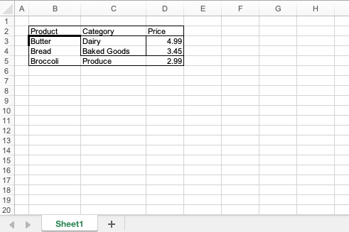

## Description

Shows how to use `add_border` to add a border to four edges of the selected cell range.

## Code

```ruby
p = Axlsx::Package.new
wb = p.workbook

wb.add_worksheet do |sheet|
  sheet.add_row
  sheet.add_row ["", "Product", "Category",  "Price"]
  sheet.add_row ["", "Butter", "Dairy",      4.99]
  sheet.add_row ["", "Bread", "Baked Goods", 3.45]
  sheet.add_row ["", "Broccoli", "Produce",  2.99]

  sheet.add_border "B2:D5"
  sheet.add_border "B3:D3", { edges: [:top], style: :thick }
  sheet.add_border ["C3:C4", "D3:D4"]

  #sheet.add_border "E1"
  #sheet.add_border "E1:E5", [:top, :bottom, :left, :right]
  #sheet.add_border "E1:E5", :all
  #sheet.add_border "E1:E5", Axlsx::Border::EDGES
  #sheet.add_border "E1:E5", {edges: :all, style: :thick}
  #sheet.add_border "E1:E5", {edges: [:top], style: :thick, color: "FFFFF00"}
end

p.serialize "add_border.xlsx"
```

## Output


