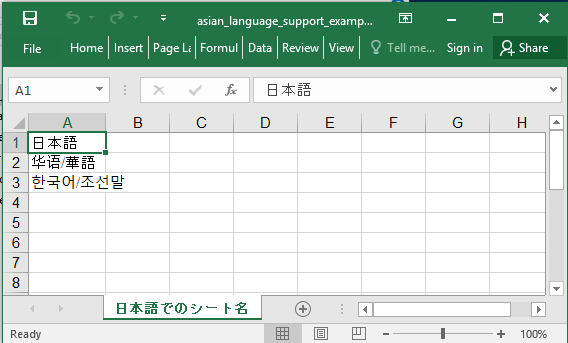

## Description

There is a support for asian language.

## Code

```ruby
require 'axlsx'

p = Axlsx::Package.new
wb = p.workbook

s = wb.styles
s.fonts.first.name = 'Arial Unicode MS'

wb.add_worksheet(name: '日本語でのシート名') do |sheet|
  sheet.add_row ['日本語']
  sheet.add_row ['华语/華語']
  sheet.add_row ['한국어/조선말']
end

p.serialize 'asian_language_support_example.xlsx'
```

## Output


