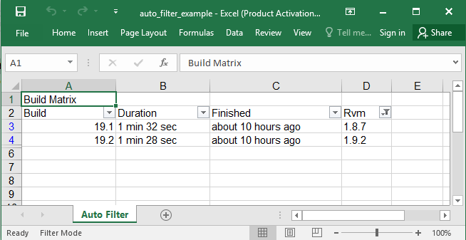
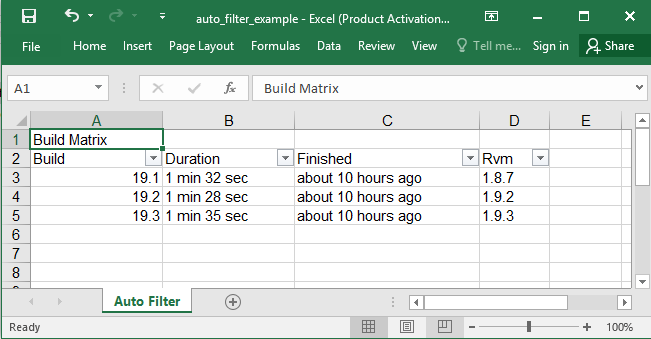

## Description

You could mark areas as auto filtered tables.

## Code

```ruby
require 'axlsx'

p = Axlsx::Package.new
wb = p.workbook

wb.add_worksheet(name: 'Auto Filter') do |sheet|
  sheet.add_row ['Build Matrix']
  sheet.add_row ['Build', 'Duration', 'Finished', 'Rvm']
  sheet.add_row ['19.1', '1 min 32 sec', 'about 10 hours ago', '1.8.7']
  sheet.add_row ['19.2', '1 min 28 sec', 'about 10 hours ago', '1.9.2']
  sheet.add_row ['19.3', '1 min 35 sec', 'about 10 hours ago', '1.9.3']
  sheet.auto_filter = 'A2:D5'
  sheet.auto_filter.add_column 3, :filters, filter_items: ['1.9.2', '1.8.7']
end

p.serialize 'auto_filter_example.xlsx'
```

## Output



After resetting the filters:


