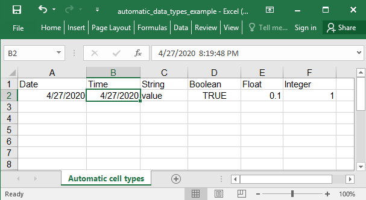

## Description

The data types are automatically calculated into the cell.

## Code

```ruby
require 'axlsx'

p = Axlsx::Package.new
wb = p.workbook

wb.add_worksheet(name: 'Automatic cell types') do |sheet|
  sheet.add_row ['Date', 'Time', 'String', 'Boolean', 'Float', 'Integer']
  sheet.add_row [Date.today, Time.now, 'value', true, 0.1, 1]
end

p.serialize 'automatic_data_types_example.xlsx'
```

## Output



Notes: The time column has the full datetime in it, you could customize it with format codes.
