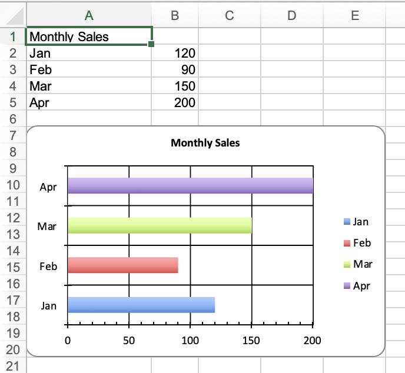

## Description

Configure major and minor tick marks on chart axes. Supported values are `:cross`, `:in`, `:none`, and `:out`.

## Code

```ruby
require 'axlsx'

p = Axlsx::Package.new
wb = p.workbook

wb.add_worksheet(name: 'Tick Marks') do |sheet|
  sheet.add_row ['Monthly Sales']

  sheet.add_row ['Jan', 120]
  sheet.add_row ['Feb', 90]
  sheet.add_row ['Mar', 150]
  sheet.add_row ['Apr', 200]

  sheet.add_chart(Axlsx::Bar3DChart, start_at: 'A7', end_at: 'F21') do |chart|
    chart.add_series data: sheet['B2:B5'], labels: sheet['A2:A5'], title: sheet['A1']

    chart.valAxis.major_tick_mark = :out
    chart.valAxis.minor_tick_mark = :in

    chart.catAxis.major_tick_mark = :cross
    chart.catAxis.minor_tick_mark = :none
  end
end

p.serialize 'axis_tick_marks_example.xlsx'
```

## Output


