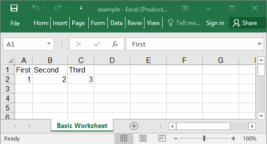

## Description

This is a very basic example with a worksheet and two rows of data.

## Code

```ruby
require 'axlsx'

p = Axlsx::Package.new
wb = p.workbook

wb.add_worksheet(name: 'Basic Worksheet') do |sheet|
  sheet.add_row ['First', 'Second', 'Third']
  sheet.add_row [1, 2, 3]
end

p.serialize 'basic_example.xlsx'
```

## Output


