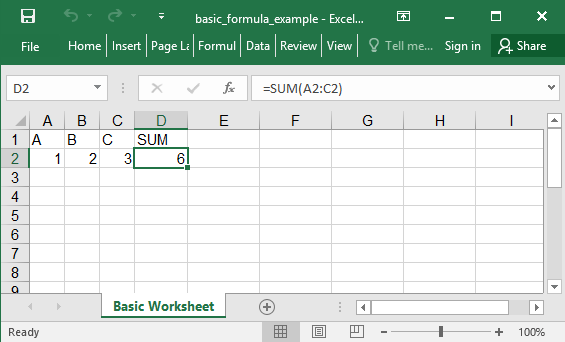

## Description

You could insert formulas

## Code

```ruby
require 'axlsx'

p = Axlsx::Package.new
wb = p.workbook

wb.add_worksheet(name: 'Basic Worksheet') do |sheet|
  sheet.add_row ['A', 'B', 'C', 'SUM']
  sheet.add_row [1, 2, 3, '=SUM(A2:C2)']
end

p.serialize 'basic_formula_example.xlsx'
```

## Output


