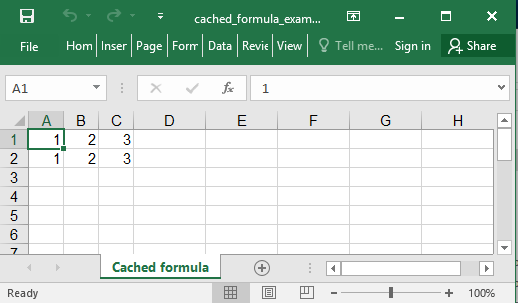

## Description

When you add a formula in Excel, it immediately calculates its value and store in the document. When you generate an xlsx file, the value is usually empty and it get calculated on the first run. If you want a nice preview with all the data provided, you could add the pre-calculated values

## Code

```ruby
require 'axlsx'

p = Axlsx::Package.new
wb = p.workbook

wb.add_worksheet(name: 'Cached formula') do | sheet |
  sheet.add_row [1, 2, 3]
  sheet.add_row [1, 2, '=A2+B2'], formula_values: [nil, nil, 3]
end

p.serialize 'cached_formula_example.xlsx'
```

## Output


