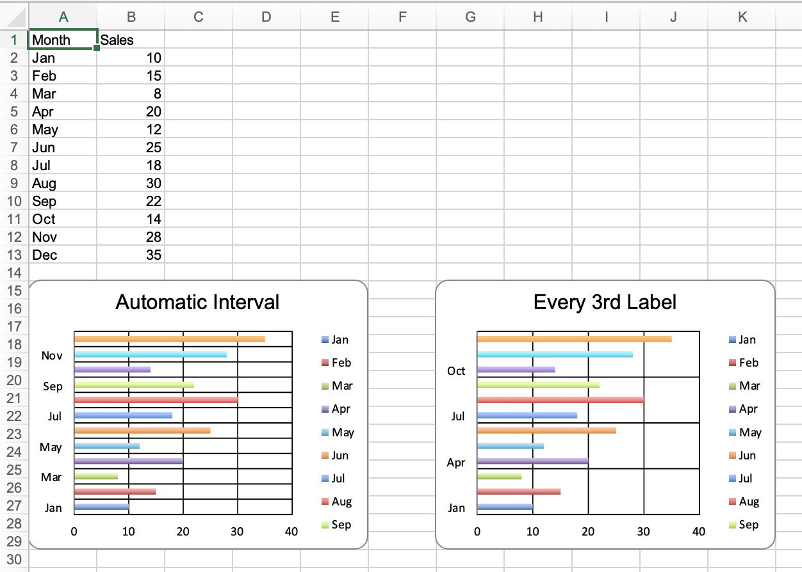

## Description

Chart axis label interval example. Demonstrates how to set the tick label interval on a category axis to either automatic (default) or a specific interval.

## Code

```ruby
require 'axlsx'

p = Axlsx::Package.new
wb = p.workbook

wb.add_worksheet(name: 'Axis Label Interval') do |sheet|
  sheet.add_row ['Month', 'Sales']

  sheet.add_row ['Jan', 10]
  sheet.add_row ['Feb', 15]
  sheet.add_row ['Mar', 8]
  sheet.add_row ['Apr', 20]
  sheet.add_row ['May', 12]
  sheet.add_row ['Jun', 25]
  sheet.add_row ['Jul', 18]
  sheet.add_row ['Aug', 30]
  sheet.add_row ['Sep', 22]
  sheet.add_row ['Oct', 14]
  sheet.add_row ['Nov', 28]
  sheet.add_row ['Dec', 35]

  # Automatic label interval (default)
  sheet.add_chart(Axlsx::Bar3DChart, start_at: 'A15', end_at: 'F30', title: 'Automatic Interval') do |chart|
    chart.add_series data: sheet['B2:B13'], labels: sheet['A2:A13']
  end

  # Explicit label interval of 3
  sheet.add_chart(Axlsx::Bar3DChart, start_at: 'G15', end_at: 'L30', title: 'Every 3rd Label') do |chart|
    chart.add_series data: sheet['B2:B13'], labels: sheet['A2:A13']
    chart.cat_axis.tick_lbl_skip = 3
    chart.cat_axis.tick_mark_skip = 3
  end
end

p.serialize 'chart_axis_label_interval_example.xlsx'
```

## Output


