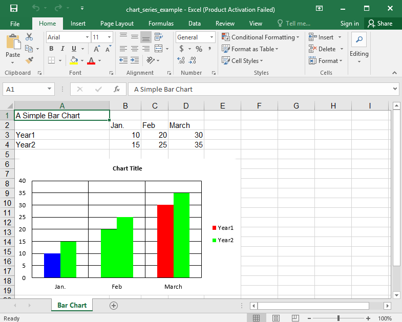

## Description

You could change the colors of the series with providing a color. Do not confuse it with defining colors for each datapoint in the series.

## Code

```ruby
require 'axlsx'

p = Axlsx::Package.new
wb = p.workbook

wb.add_worksheet(name: 'Bar Chart') do |sheet|
  sheet.add_row ['A Simple Bar Chart']

  sheet.add_row ['', 'Jan.', 'Feb', 'March']
  sheet.add_row ['Year1', 10, 20, 30]
  sheet.add_row ['Year2', 15, 25, 35]

  sheet.add_chart(Axlsx::BarChart, start_at: 'A6', end_at: 'F20') do |chart|
    chart.barDir = :col
    chart.bg_color = 'FFFFFF'
    # The first series will be red, but some bars will be overwritten to blue and green
    chart.add_series data: sheet['B3:D3'], title: sheet['A3'], labels: sheet['B2:D2'], color: 'FF0000', colors: ['0000FF', '00FF00']
    # The second series will be green
    chart.add_series data: sheet['B4:D4'], title: sheet['A4'], labels: sheet['B2:D2'], color: '00FF00'
  end
end

p.serialize 'chart_series_color_example.xlsx'
```

## Output


