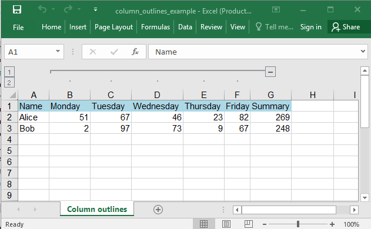
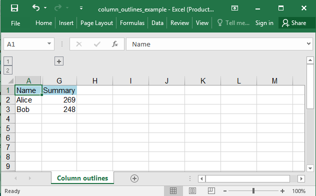

## Description

If you have a list of data that you want to group and summarize, you can create an outline of up to eight levels. Each inner level, represented by a higher number in the outline symbols, displays detail data for the preceding outer level, represented by a lower number in the outline symbols.

## Code

```ruby
require 'axlsx'

Axlsx.escape_formulas = false

p = Axlsx::Package.new
wb = p.workbook

s = wb.styles
header = s.add_style bg_color: 'ADD8E6'
summary = s.add_style b: true

wb.add_worksheet(name: 'Column outlines') do |sheet|
  # Header
  sheet.add_row ['Name', 'Monday', 'Tuesday', 'Wednesday', 'Thursday', 'Friday', 'Summary'], style: header
  sheet.add_row ['Alice', 51, 67, 46, 23, 82, '=sum(B2:F2)']
  sheet.add_row ['Bob', 2, 97, 73, 9, 67, '=sum(B3:F3)']

  sheet.outline_level_columns 1, 5, 1, false # From col 1 to col 5, level 1, open
end

p.serialize 'column_outlines_example.xlsx'
```

## Output



After closing the outline:


