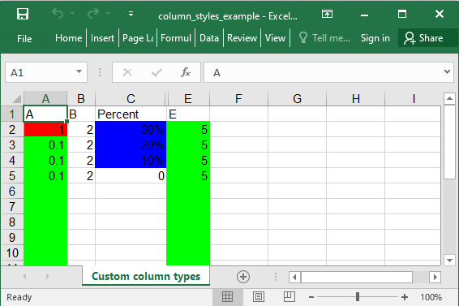

## Description

There is a way to add styles to a whole column.

## Code

```ruby
require 'axlsx'

p = Axlsx::Package.new
wb = p.workbook

s = wb.styles
percent = s.add_style num_fmt: 9, bg_color: '0000FF'
highlight = s.add_style bg_color: 'FF0000'
default_green = s.add_style bg_color: '00FF00'

wb.add_worksheet(name: 'Custom column types') do |sheet|
  sheet.add_row ['A', 'B', 'Percent', 'Hidden', 'E']

  # Apply default style to columns A and E - it will be used for cells defined after this line and all undefined cells in the column
  sheet.column_styles default_green, nil, nil, nil, default_green

  # Override the default column style with the usual style optional param
  sheet.add_row [  1, 2, 0.3, 4, 5.0], style: [highlight]
  sheet.add_row [0.1, 2, 0.2, 4, 5.0]
  sheet.add_row [0.1, 2, 0.1, 4, 5.0]

  # Apply the percent style to the cells already defined in a column at index 2 skipping the first row.
  sheet.col_style 2, percent, row_offset: 1

  sheet.add_row [0.1, 2, 0.0, 4, 5.0]

  # Apply the hidden attribute to the column at index 3
  sheet.column_info[3].hidden = true
end

p.serialize 'column_styles_example.xlsx'
```

## Output


