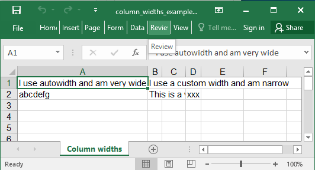

## Description

You can set the column widths

## Code

```ruby
require 'axlsx'

p = Axlsx::Package.new
wb = p.workbook

wb.add_worksheet(name: 'Column widths') do |sheet|
  sheet.add_row [
    'I use autowidth and am very wide',
    'I use a custom width and am narrow'
  ]

  sheet.add_row [
    'abcdefg',
    'This is a very long text and should flow into the right cell',
    nil,
    'xxx'
  ]

  sheet.column_widths nil, 3, 5, nil
end

p.serialize 'column_widths_example.xlsx'
```

## Output


