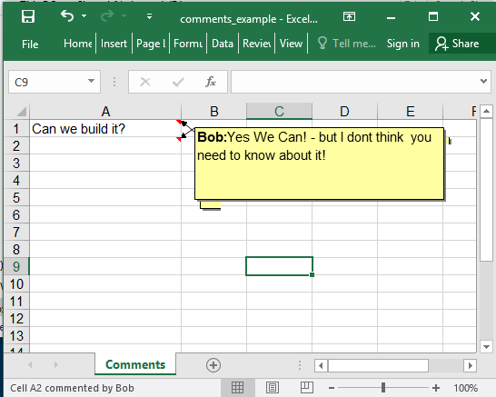

## Description

You could add comments (visible or hidden) to the cells.

## Code

```ruby
require 'axlsx'

p = Axlsx::Package.new
wb = p.workbook

wb.add_worksheet(name: 'Comments') do |sheet|
  sheet.add_row ['Can we build it?']
  sheet.add_comment ref: 'A1', author: 'Bob', text: 'Yes We Can!'
  sheet.add_comment ref: 'A2', author: 'Bob', text: 'Yes We Can! - but I dont think  you need to know about it!', visible: false
end

p.serialize 'comments_example.xlsx'
```

## Output


After hovering on the hidden comment:


