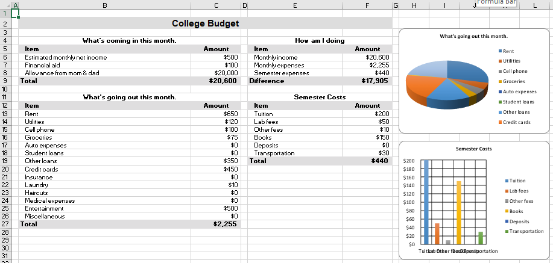

## Description

This is a complex example with a worksheet full of data.

## Code

```ruby
require 'axlsx'

p = Axlsx::Package.new
wb = p.workbook

s = wb.styles
header     = s.add_style bg_color: 'DD', sz: 16, b: true, alignment: { horizontal: :center }
tbl_header = s.add_style b: true, alignment: { horizontal: :center }
ind_header = s.add_style bg_color: 'FFDFDEDF', b: true, alignment: { indent: 1 }
col_header = s.add_style bg_color: 'FFDFDEDF', b: true, alignment: { horizontal: :center }
label      = s.add_style alignment: { indent: 1 }
money      = s.add_style num_fmt: 5
t_label    = s.add_style b: true, bg_color: 'FFDFDEDF'
t_money    = s.add_style b: true, num_fmt: 5, bg_color: 'FFDFDEDF'

wb.add_worksheet do |sheet|
  sheet.add_row
  sheet.add_row ['College Budget'], style: header, offset: 1

  sheet.add_row
  sheet.add_row ["What's coming in this month.", nil, nil, 'How am I doing'], style: tbl_header, offset: 1
  sheet.add_row ['Item', 'Amount', nil, 'Item', 'Amount'], style: [ind_header, col_header, nil, ind_header, col_header], offset: 1
  sheet.add_row ['Estimated monthly net income', 500, nil, 'Monthly income', '=C9'], style: [label, money, nil, label, money], offset: 1
  sheet.add_row ['Financial aid', 100, nil, 'Monthly expenses', '=C27'], style: [label, money, nil, label, money], offset: 1
  sheet.add_row ['Allowance from mom & dad', 20000, nil, 'Semester expenses', '=F19'], style: [label, money, nil, label, money], offset: 1
  sheet.add_row ['Total', '=SUM(C6:C8)', nil, 'Difference', '=F6 - SUM(F7:F8)'], style: [t_label, t_money, nil, t_label, t_money], offset: 1

  sheet.add_row
  sheet.add_row ["What's going out this month.", nil, nil, 'Semester Costs'], style: tbl_header, offset: 1
  sheet.add_row ['Item', 'Amount', nil, 'Item', 'Amount'], style: [ind_header, col_header, nil, ind_header, col_header], offset: 1
  sheet.add_row ['Rent', 650, nil, 'Tuition', 200], style: [label, money, nil, label, money], offset: 1
  sheet.add_row ['Utilities', 120, nil, 'Lab fees', 50], style: [label, money, nil, label, money], offset: 1
  sheet.add_row ['Cell phone', 100, nil, 'Other fees', 10], style: [label, money, nil, label, money], offset: 1
  sheet.add_row ['Groceries', 75, nil, 'Books', 150], style: [label, money, nil, label, money], offset: 1
  sheet.add_row ['Auto expenses', 0, nil, 'Deposits', 0], style: [label, money, nil, label, money], offset: 1
  sheet.add_row ['Student loans', 0, nil, 'Transportation', 30], style: [label, money, nil, label, money], offset: 1
  sheet.add_row ['Other loans', 350, nil, 'Total', '=SUM(F13:F18)'], style: [label, money, nil, t_label, t_money], offset: 1
  sheet.add_row ['Credit cards', 450], style: [label, money], offset: 1
  sheet.add_row ['Insurance', 0], style: [label, money], offset: 1
  sheet.add_row ['Laundry', 10], style: [label, money], offset: 1
  sheet.add_row ['Haircuts', 0], style: [label, money], offset: 1
  sheet.add_row ['Medical expenses', 0], style: [label, money], offset: 1
  sheet.add_row ['Entertainment', 500], style: [label, money], offset: 1
  sheet.add_row ['Miscellaneous', 0], style: [label, money], offset: 1
  sheet.add_row ['Total', '=SUM(C13:C26)'], style: [t_label, t_money], offset: 1

  sheet.add_chart(Axlsx::Pie3DChart) do |chart|
    chart.title = sheet['B11']
    chart.add_series data: sheet['C13:C26'], labels: sheet['B13:B26']
    chart.start_at 7, 2
    chart.end_at 12, 15
  end

  sheet.add_chart(Axlsx::Bar3DChart, barDir: :col) do |chart|
    chart.title = sheet['E11']
    chart.add_series labels: sheet['E13:E18'], data: sheet['F13:F18']
    chart.start_at 7, 16
    chart.end_at 12, 31
  end

  [
    'B4:C4',
    'E4:F4',
    'B11:C11',
    'E11:F11',
    'B2:F2'
  ].each { |range| sheet.merge_cells(range) }

  sheet.column_widths 2, nil, nil, 2, nil, nil, 2
end

p.serialize 'complex_example.xlsx'
```

## Output


