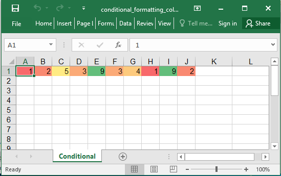

## Description

Conditional format example: Color scale.

## Code

```ruby
require 'axlsx'

p = Axlsx::Package.new
wb = p.workbook

s = wb.styles
high = s.add_style bg_color: 'FF428751', type: :dxf

wb.add_worksheet(name: 'Conditional') do |sheet|
  # Use 10 random number
  sheet.add_row Array.new(10) { (rand * 10).floor }

  # Axlsx::ColorScale has two_tone and three_tone class methods to setup the excel defaults (2011)
  # alternatively, you can pass in
  # {type: [:min, :max, :percent], val: [whatever], color: [Some RGB String] to create a customized color scale object
  color_scale = Axlsx::ColorScale.three_tone

  sheet.add_conditional_formatting('A1:J1',
    type: :colorScale,
    operator: :greaterThan,
    formula: '7',
    dxfId: high,
    priority: 1,
    color_scale: color_scale)
end

p.serialize 'conditional_formatting_color_scale_example.xlsx'
```

## Output


