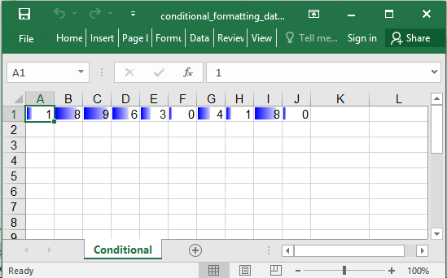

## Description

Conditional format example: Data bar.

## Code

```ruby
require 'axlsx'

p = Axlsx::Package.new
wb = p.workbook

s = wb.styles
high = s.add_style bg_color: 'FF428751', type: :dxf

wb.add_worksheet(name: 'Conditional') do |sheet|
  # Use 10 random number
  sheet.add_row Array.new(10) { (rand * 10).floor }

  data_bar = Axlsx::DataBar.new
  sheet.add_conditional_formatting('A1:J1',
    type: :dataBar,
    dxfId: high,
    priority: 1,
    data_bar: data_bar)
end

p.serialize 'conditional_formatting_data_bar_example.xlsx'
```

## Output


