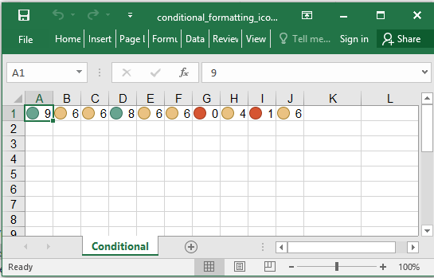

## Description

Conditional format example: Icon set.

## Code

```ruby
require 'axlsx'

p = Axlsx::Package.new
wb = p.workbook

s = wb.styles
high = s.add_style bg_color: 'FF428751', type: :dxf

wb.add_worksheet(name: 'Conditional') do |sheet|
  # Use 10 random number
  sheet.add_row Array.new(10) { (rand * 10).floor}

  icon_set = Axlsx::IconSet.new
  sheet.add_conditional_formatting('A1:J1', { type: :iconSet, dxfId: high, priority: 1, icon_set: icon_set })
end

p.serialize 'conditional_formatting_icon_set_example.xlsx'
```

## Output


