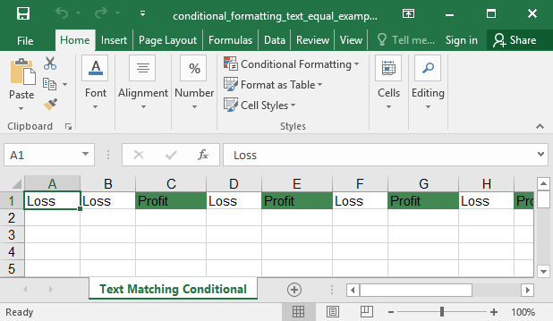

## Description

Conditional format example: Text equal

1. You must specify `:containsText` for both type and operator.
2. You must craft a formula to match what you are looking for. The formula needs to reference the top-left cell of the range (the cell reference will be dynamically adapted when the formula gets evaluated for the other cells in the range).
3. The formula may turn out to be vendor specific. You will want to test extensively if interoperability beyond excel is a concern.

## Code

```ruby
require 'axlsx'

p = Axlsx::Package.new
wb = p.workbook

s = wb.styles
profit = s.add_style bg_color: 'FF428751', type: :dxf

wb.add_worksheet(name: 'Text Matching Conditional') do |sheet|
  sheet.add_row ["Loss", "Loss", "Profit", "Loss", "Profit", "Loss", "Profit", "Loss", "Profit", "Profit"]

  # Highlight all the cells containing the text "Profit"
  sheet.add_conditional_formatting('A1:J1',
    type: :containsText,
    operator: :containsText,
    formula: 'NOT(ISERROR(SEARCH("Profit",A1)))',
    dxfId: profit,
    priority: 1)
end

p.serialize 'conditional_formatting_text_equal_example.xlsx'
```

## Output


