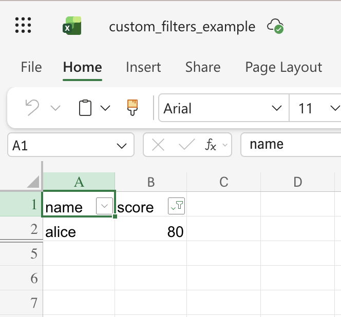
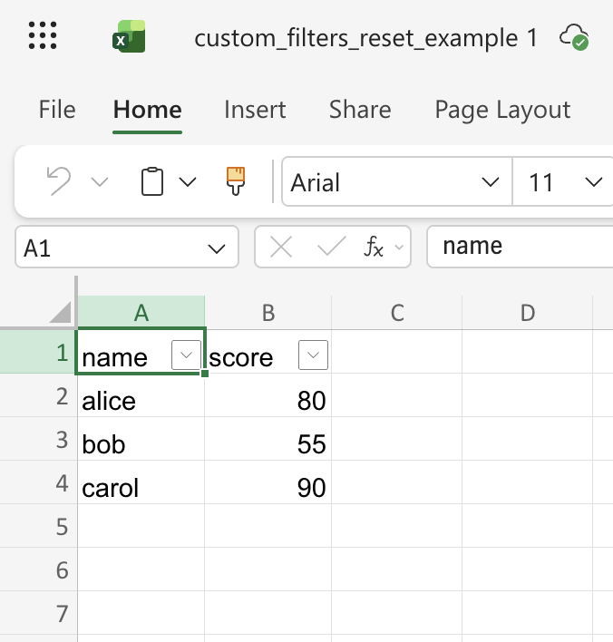

## Description

Use `custom_filters` on a column to express numeric or text criteria (e.g. greater than, between, contains). This writes `<customFilters>` in the workbook XML; Excel applies the rules when the file is opened.

## Code

```ruby
require 'axlsx'

p = Axlsx::Package.new
wb = p.workbook

wb.add_worksheet(name: 'Custom filters') do |sheet|
  sheet.add_row %w[name score]
  sheet.add_row %w[alice 80]
  sheet.add_row %w[bob 55]
  sheet.add_row %w[carol 90]

  sheet.auto_filter = 'A1:B4'
  sheet.auto_filter.add_column(
    1,
    :custom_filters,
    and: true,
    custom_filter_items: [
      { operator: :greaterThanOrEqual, val: 60 },
      { operator: :lessThanOrEqual, val: 85 }
    ]
  )
end

p.serialize 'custom_filters_example.xlsx'
```

## Output



After resetting the filters:


