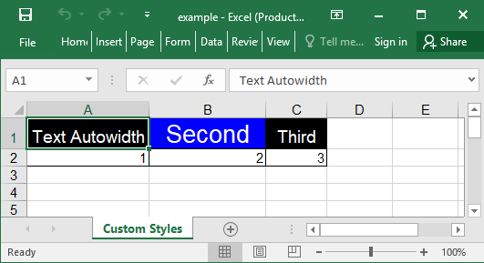

## Description

Each cell allows a single, predefined style. When using `add_row`, the value in the `style` array at the same index as the cell's column will be applied to that cell. Alternatively, you can apply a style to an entire row by using an integer value for `style`.


## Code

```ruby
require 'axlsx'

p = Axlsx::Package.new
wb = p.workbook

s = wb.styles
black_cell = s.add_style bg_color: '00', fg_color: 'FF', sz: 14, alignment: { horizontal: :center }
blue_cell = s.add_style bg_color: '0000FF', fg_color: 'FF', sz: 20, alignment: { horizontal: :center }

wb.add_worksheet(name: 'Custom Styles') do |sheet|
  # Applies the black_cell style to the first and third cell, and the blue_cell style to the second.
  sheet.add_row ['Text Autowidth', 'Second', 'Third'], style: [black_cell, blue_cell, black_cell]

  # Applies the thin border to all three cells
  sheet.add_row [1, 2, 3], style: Axlsx::STYLE_THIN_BORDER
end

p.serialize 'custom_styles_example.xlsx'
```

## Output


