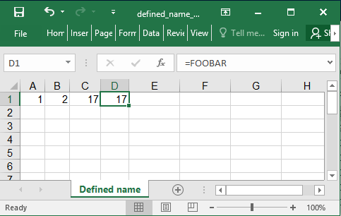

## Description

You could use defined names in formulas

## Code

```ruby
require 'axlsx'

Axlsx.escape_formulas = false

p = Axlsx::Package.new
wb = p.workbook

wb.add_worksheet(name: 'Defined name') do |sheet|
  sheet.add_row [1, 2, 17, '=FOOBAR']

  wb.add_defined_name("'defined name'!$C1", local_sheet_id: sheet.index, name: 'FOOBAR')
end

p.serialize 'defined_name_example.xlsx'
```

## Output


