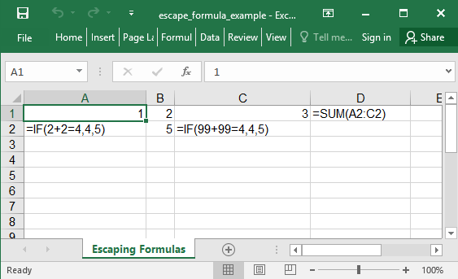

## Description

You may escape formulas using `escape_formulas` on the global, workbook, worksheet, row and/or cell level.
This is used to prevent [Formula Injection](https://www.owasp.org/index.php/CSV_Injection) vulnerabilities.

The following are possible:

| Scope     | Example                                                                  | Notes                                                                                      |
|-----------|--------------------------------------------------------------------------|--------------------------------------------------------------------------------------------|
| Global    | `Axlsx.escape_formulas = true`                                           | Affects worksheets created *after* setting. Does not affect existing worksheets.           |
| Workbook  | `workbook.escape_formulas = true`                                        | Affects child worksheets added *after* setting. Does not affect existing child worksheets. |
| Worksheet | `workbook.add_worksheet(name: 'Name', escape_formulas: true)`            |                                                                                            |
| Worksheet | `worksheet.worksheet = true`                                             | Affects child rows/cells added *after* setting. Does not affect existing child rows/cells. |
| Row       | `worksheet.add_row(['=FOO()', '=BAR()], escape_formulas: [true, false])` | Can specify as either Boolean (all cells) or Array (one value per cell).                   |
| Row       | `row.escape_formulas = [true, false]`                                    | Changes the `escape_formulas` value on existing cells. Can use either Boolean or Array.    |
| Cell      | `cell.escape_formulas = true`                                            |                                                                                            |

## Code

```ruby
require 'axlsx'

Axlsx.escape_formulas = true

p = Axlsx::Package.new
wb = p.workbook
wb.escape_formulas #=> true (initial value will be Axlsx.escape_formulas)

wb.add_worksheet(name: 'Escaping Formulas') do |sheet|
  sheet.add_row [1, 2, 3, '=SUM(A2:C2)'], escape_formulas: true
  sheet.add_row [
    '=IF(2+2=4,4,5)',
    '=IF(13+13=4,4,5)',
    '=IF(99+99=4,4,5)'
  ], escape_formulas: [true, false, true]

  sheet.rows.first.cells.first.escape_formulas = false
end

p.serialize 'escape_formula_example.xlsx'
```

## Output


