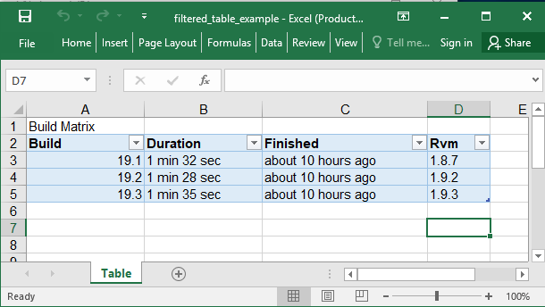

## Description

You could add areas as filtered table

## Code

```ruby
require 'axlsx'

p = Axlsx::Package.new
wb = p.workbook

wb.add_worksheet(name: 'Table') do |sheet|
  sheet.add_row ['Build Matrix']
  sheet.add_row ['Build', 'Duration', 'Finished', 'Rvm']
  sheet.add_row ['19.1', '1 min 32 sec', 'about 10 hours ago', '1.8.7']
  sheet.add_row ['19.2', '1 min 28 sec', 'about 10 hours ago', '1.9.2']
  sheet.add_row ['19.3', '1 min 35 sec', 'about 10 hours ago', '1.9.3']

  sheet.add_table 'A2:D5', name: 'Build Matrix', style_info: { name: 'TableStyleMedium23' }
end

p.serialize 'filtered_table_example.xlsx'
```

## Output


