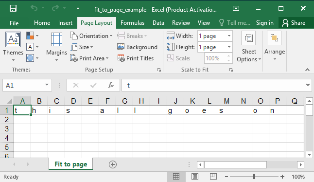
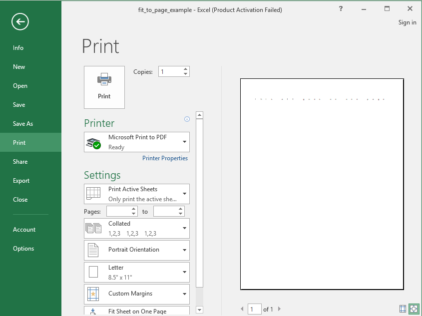

## Description

This is a very basic example with a worksheet and two rows of data.

## Code

```ruby
require 'axlsx'

p = Axlsx::Package.new
wb = p.workbook

wb.add_worksheet(name: 'Fit to page') do |sheet|
  sheet.add_row 'this all goes on one page'.split('')
  sheet.page_setup.fit_to width: 1, height: 1
end

p.serialize 'fit_to_page_example.xlsx'
```

## Output




