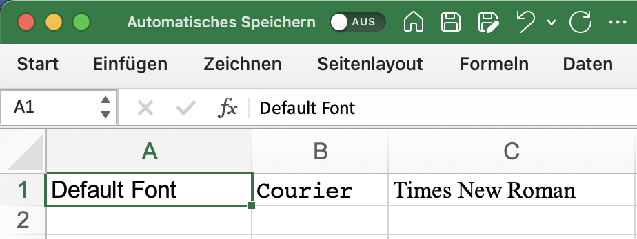

## Description

This example shows how to use different fonts. (See [custom_styles_example.md](custom_styles_example.md) for more advanced styling.)

## Code

```ruby
require 'axlsx'

p = Axlsx::Package.new
wb = p.workbook

s = wb.styles
courier = s.add_style font_name: 'Courier'
times = s.add_style font_name: 'Times New Roman'

wb.add_worksheet(name: 'Custom Styles') do |sheet|
  sheet.add_row ['Default Font', 'Courier', 'Times New Roman'], style: [nil, courier, times]
end

p.serialize 'font_example.xlsx'
```

## Output


