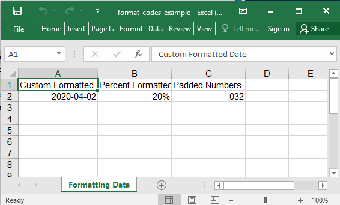

## Description

You could define custom format codes.

## Code

```ruby
require 'axlsx'

p = Axlsx::Package.new
wb = p.workbook

s = wb.styles
date = s.add_style format_code: 'yyyy-mm-dd'
percent = s.add_style format_code: '0%'
padded = s.add_style format_code: '00#'

wb.add_worksheet(name: 'Formatting Data') do |sheet|
  # require 'date'
  sheet.add_row ['Custom Formatted Date', 'Percent Formatted Float', 'Padded Numbers']
  sheet.add_row [Date.today, 0.2, 32], style: [date, percent, padded]
end

p.serialize 'format_codes_example.xlsx'
```

## Output


