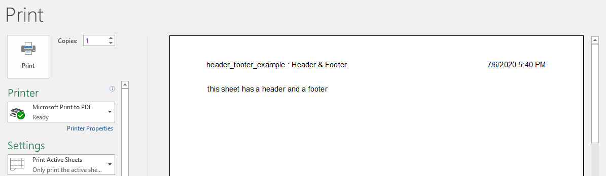

## Description

You could add header and footer to the sheet, even with the templating of excel.

## Code

```ruby
require 'axlsx'

p = Axlsx::Package.new
wb = p.workbook

header_footer = {
  different_first: false,
  odd_header: '&L&F : &A&R&D &T',
  odd_footer: '&C&Pof&N'
}

wb.add_worksheet(name: 'Header & Footer', header_footer: header_footer) do |sheet|
  sheet.add_row ['this sheet has a header and a footer']
end

p.serialize 'header_footer_example.xlsx'
```

## Output


