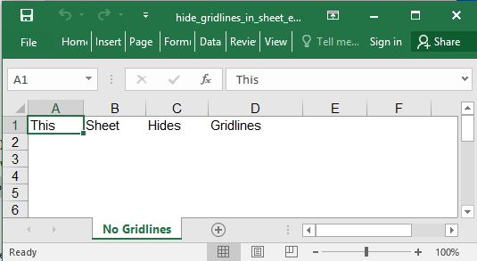

## Description

This is a very basic example to hide gridlines.

## Code

```ruby
require 'axlsx'

p = Axlsx::Package.new
wb = p.workbook

wb.add_worksheet(name: 'No Gridlines') do |sheet|
  sheet.add_row ['This', 'Sheet', 'Hides', 'Gridlines']
  sheet.sheet_view.show_grid_lines = false
end

p.serialize 'hide_gridlines_in_sheet_example.xlsx'
```

## Output


