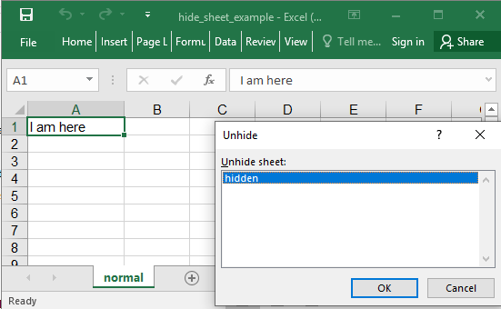

## Description

This is a very basic example with a worksheet and two rows of data.

## Code

```ruby
require 'axlsx'

p = Axlsx::Package.new
wb = p.workbook

wb.add_worksheet(name: 'normal') do |sheet|
  sheet.add_row ['I am here']
end

wb.add_worksheet(name: 'hidden', state: :hidden) do |sheet|
  sheet.add_row ['you cant see me!']
end

wb.add_worksheet(name: 'very hidden', state: :very_hidden) do |sheet|
  sheet.add_row ['you really cant see me!']
end

p.serialize 'hide_sheet_example.xlsx'
```

## Output


