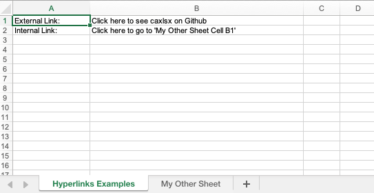

## Description

You could create an internal or external hyperlink. The ref could be a string referencing to an existing cell or a cell object.

## Code

```ruby
require 'axlsx'

p = Axlsx::Package.new
wb = p.workbook

wb.add_worksheet(name: 'Hyperlinks Examples') do |sheet|
  # External References (HTML Links)
  sheet.add_row ["External Link:", "Click here to see caxlsx on Github"]
  sheet.add_hyperlink location: 'https://github.com/caxlsx/caxlsx', ref: "B1"
  
  # Internal References (Links pointing to within the Workbook)
  sheet.add_row ["Internal Link:", "Click here to go to 'My Other Sheet Cell B1'"]
  sheet.add_hyperlink(
    location: "'My Other Sheet'!B1", ### This link will point to Cell B1 of the Worksheet named "My Other Sheet".
    target: :sheet, ### This is :external by default. If you set it to anything else, the location is interpreted to be the current workbook.
    ref: 'B2' ### Cell location of the link in this sheet
  )
end

wb.add_worksheet(name: 'My Other Sheet') do |sheet|
  sheet.add_row ['Hello', 'World']
end

p.serialize 'hyperlink_example.xlsx'
```

## Output


