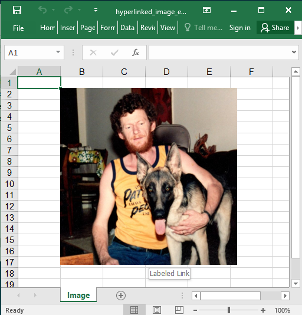

## Description

You could add hyerlinks to images.

## Code

```ruby
require 'axlsx'

p = Axlsx::Package.new
wb = p.workbook

image = File.expand_path('assets/image1.jpeg')

wb.add_worksheet(name: 'Image') do |sheet|
  sheet.add_image(image_src: image, start_at: 'B2', width: 300, height: 300, hyperlink: 'https://github.com/caxlsx') do |img|
    img.hyperlink.tooltip = 'Labeled Link'
  end
end

p.serialize 'hyperlinked_image_example.xlsx'
```

## Output


