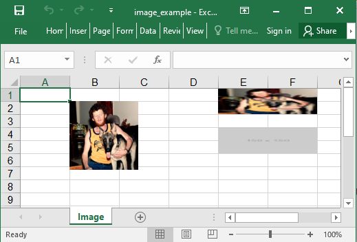

## Description

You could add images. All the options could be added in a do block, so instead of `sheet.add_image(width: 720)` you could say `sheet.add_image { |image| image.width = 720 }`.

## Code

```ruby
require 'axlsx'

p = Axlsx::Package.new
wb = p.workbook

image = File.expand_path('assets/image1.jpeg')

wb.add_worksheet(name: 'Image') do |sheet|
  sheet.add_image(image_src: image, start_at: 'B2', width: 100, height: 100)
  sheet.add_image(image_src: image, start_at: 'E1', end_at: 'G3')
end

p.serialize 'image_example.xlsx'
```

## Output


