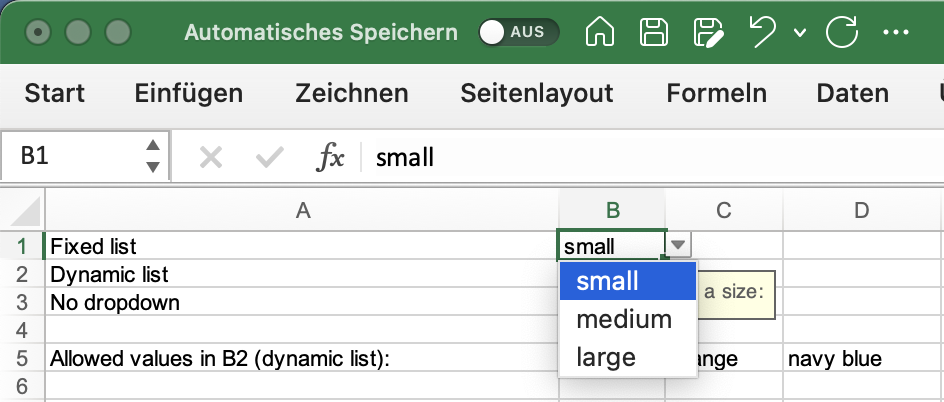

## Description

You could validate data based on an explicit list or a given range of cells.

## Code

```ruby
require 'axlsx'

p = Axlsx::Package.new
wb = p.workbook

wb.add_worksheet(name: 'Basic Worksheet') do |sheet|
  sheet.add_row ['Fixed list', 'small']
  sheet.add_row ['Dynamic list', 'red']
  sheet.add_row ['No dropdown', 'north']
  sheet.add_row
  sheet.add_row ['Allowed values in B2 (dynamic list):', 'red', 'orange', 'navy blue']
  sheet.add_data_validation('B1:B1',
    type: :list,
    formula1: '"small, medium, large"',
    showErrorMessage: true,
    errorTitle: '',
    error: 'Allowed values: small, medium, large',
    errorStyle: :stop,
    showInputMessage: true,
    promptTitle: '',
    prompt: 'Choose a size:')

  sheet.add_data_validation('B2:B2',
    type: :list,
    formula1: 'B5:D5',
    showErrorMessage: true,
    errorTitle: '',
    error: 'Only values from B5:D5 allowed!',
    errorStyle: :stop,
    showInputMessage: true,
    prompt: 'Choose a color (from list in B5:D5):')

  sheet.add_data_validation('B3:B3',
    type: :list,
    formula1: '"north, east, south, west"',
    hideDropDown: true,
    showErrorMessage: true,
    errorTitle: '',
    error: 'Allowed values: north, east, south, west',
    errorStyle: :stop,
    showInputMessage: true,
    prompt: 'Enter a direction:')
end

p.serialize 'list_validation_example.xlsx'
```

## Output

Validating with dropdown:



Validating without dropdown:


