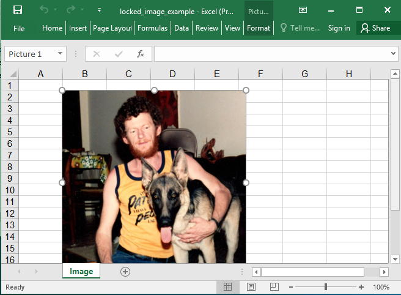

## Description

Images could have a lot of restrictions.

* noGrp
* noSelect - disable selection
* noRot - disable rotation
* noChangeAspect (default true) - disable aspect change
* noMove - disable move
* noResize - disable resize
* noEditPoints
* noAdjustHandles
* noChangeArrowheads
* noChangeShapeType

## Code

```ruby
require 'axlsx'

p = Axlsx::Package.new
wb = p.workbook

image = File.expand_path('assets/image1.jpeg')

wb.add_worksheet(name: 'Image') do |sheet|
  sheet.add_image(image_src: image, start_at: 'B2', width: 300, height: 300, noRot: true)
end

p.serialize 'locked_image_example.xlsx'
```

## Output


