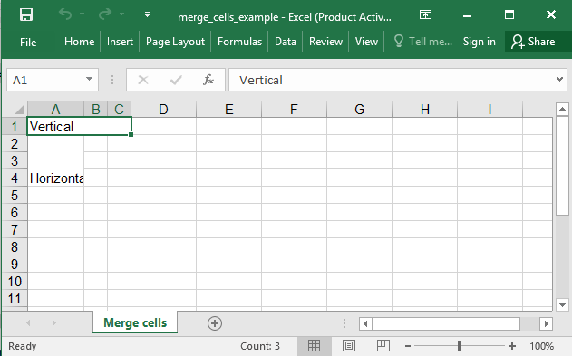

## Description

You could merge cells

## Code

```ruby
require 'axlsx'

p = Axlsx::Package.new
wb = p.workbook

wb.add_worksheet(name: 'Merge cells') do |sheet|
  sheet.add_row ['Vertical', '', '']
  sheet.add_row ['Horizontal']
  sheet.add_row ['']
  sheet.add_row ['']

  sheet.merge_cells('A1:C1')
  sheet.merge_cells('A2:A4')
end

p.serialize 'merge_cells_example.xlsx'
```

## Output


