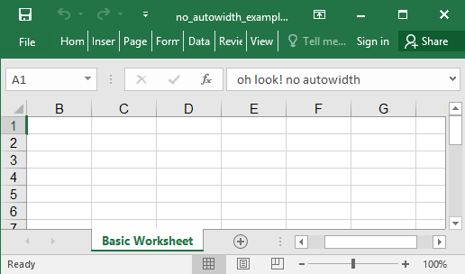

## Description

This is a very basic example with a worksheet and two rows of data.

## Code

```ruby
require 'axlsx'

p = Axlsx::Package.new
p.use_autowidth = false

wb = p.workbook

wb.add_worksheet(name: 'Basic Worksheet') do |sheet|
  sheet.add_row ['oh look! no autowidth']
end

p.serialize 'no_autowidth_example.xlsx'
```

## Output


