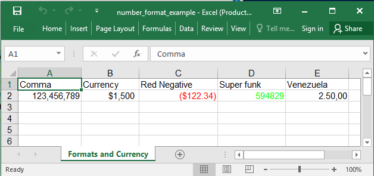

## Description


## Code

```ruby
require 'axlsx'

p = Axlsx::Package.new
wb = p.workbook

s = wb.styles
comma = s.add_style num_fmt: 3
currency = s.add_style num_fmt: 5
red_negative = s.add_style num_fmt: 8
super_funk = s.add_style format_code: '[Green]#'
venezuela_currency = s.add_style format_code: '#.##0\,00'

wb.add_worksheet(name: 'Formats and Currency') do |sheet|
  sheet.add_row ['Comma', 'Currency', 'Red Negative', 'Super funk', 'Venezuela']
  sheet.add_row [123456789, 1500, -122.34, 594829, 2.5], style: [comma, currency, red_negative, super_funk, venezuela_currency]
end

p.serialize 'number_format_example.xlsx'
```

## Output


