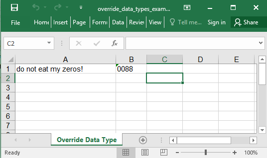

## Description

You could override the automatic data types

## Code

```ruby
require 'axlsx'

p = Axlsx::Package.new
wb = p.workbook

wb.add_worksheet(name: 'Override Data Type') do |sheet|
  sheet.add_row ['do not eat my zeros!', '0088'] , :types => [nil, :string]
end

p.serialize 'override_data_types_example.xlsx'
```

## Output


