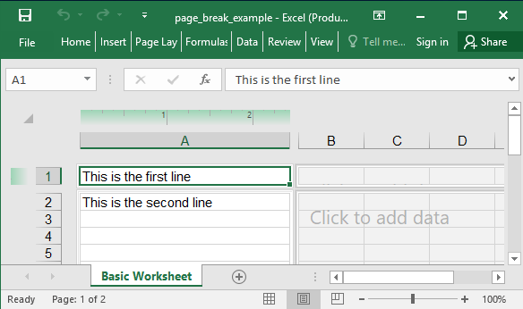

## Description

This is a very basic example with a worksheet and two rows of data.

## Code

```ruby
require 'axlsx'

p = Axlsx::Package.new
wb = p.workbook

wb.add_worksheet(name: 'Basic Worksheet') do |sheet|
  sheet.add_row ['This is the first line']
  sheet.add_row ['This is the second line']
  sheet.add_page_break('B2')
  sheet.sheet_view.view = :page_layout # so you can see the breaks!
end

p.serialize 'page_break_example.xlsx'
```

## Output


