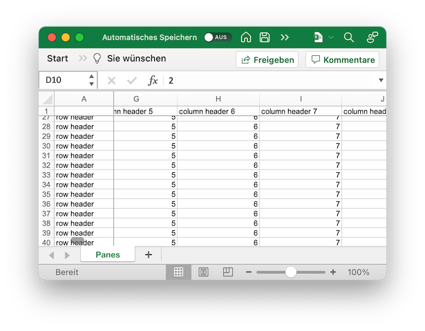

## Description

You can split the sheet into panes. `pane.state` could have three options: `split`, `frozen` or `frozen_split`

## Code

```ruby
require 'axlsx'

p = Axlsx::Package.new
wb = p.workbook

wb.add_worksheet(name: 'Panes') do |sheet|
  # Generate a big dataset
  sheet.add_row [''] + (0..99).map { |i| "column header #{i}" }
  100.times { |index| sheet.add_row ['row header'] + (0..index).to_a }

  sheet.sheet_view.pane do |pane|
    pane.top_left_cell = 'B2'
    pane.state = :frozen_split
    pane.y_split = 1
    pane.x_split = 1
    pane.active_pane = :bottom_right
  end
end

p.serialize 'panes_example.xlsx'
```

## Output


