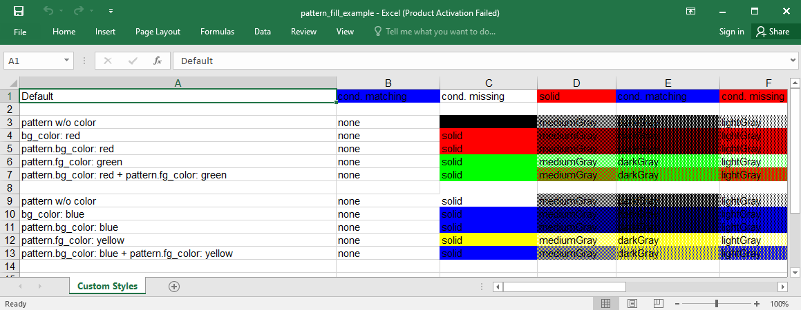

## Description

You can apply various fill patterns to the cells. The default fill is `solid` and could be set with `bg_color`. However, if you want to use multiple colors (e.g: `lightHorizontal` lines), you should set `pattern_type`, `pattern_bg_color` and `pattern_fg_color`.


## Code

```ruby
require 'axlsx'

p = Axlsx::Package.new
wb = p.workbook

s = wb.styles

pattern_types = Axlsx::VALID_PATTERN_TYPE_VALUES

red = 'FF0000'
green = '00FF00'
blue = '0000FF'
yellow = 'FFFF00'

def add_conditional_formatting(wb, sheet, cell, text, **style)
  sheet.add_conditional_formatting("#{cell.r}:#{cell.r}",
    type: :containsText,
    operator: :containsText,
    priority: 1,
    formula: "NOT(ISERROR(SEARCH(\"#{text}\",#{cell.r})))",
    dxfId: wb.styles.add_style(style))
end

wb.add_worksheet(name: 'Custom Styles') do |sheet|
  # Basic functionality: have a simple background with simple conditional formatting
  sheet.add_row do |row|
    row.add_cell 'Default'

    cell = row.add_cell 'cond. matching'
    add_conditional_formatting(wb, sheet, cell, 'cond. matching', bg_color: blue, type: :dxf)

    cell = row.add_cell 'cond. missing'
    add_conditional_formatting(wb, sheet, cell, 'xx', bg_color: blue, type: :dxf)

    row.add_cell 'solid', style: s.add_style(bg_color: red)

    cell = row.add_cell 'cond. matching', style: s.add_style(bg_color: red)
    add_conditional_formatting(wb, sheet, cell, 'cond. matching', bg_color: blue, type: :dxf)

    cell = row.add_cell 'cond. missing', style: s.add_style(bg_color: red)
    add_conditional_formatting(wb, sheet, cell, 'xx', bg_color: blue, type: :dxf)
  end

  sheet.add_row []

  # Using patterns for background
  sheet.add_row do |row|
    row.add_cell 'pattern w/o color'
    pattern_types.each do |type|
      row.add_cell type.to_s, style: s.add_style(pattern_type: type)
    end
  end

  sheet.add_row do |row|
    row.add_cell 'bg_color: red'
    pattern_types.each do |type|
      row.add_cell type.to_s, style: s.add_style(bg_color: red, pattern_type: type)
    end
  end

  sheet.add_row do |row|
    row.add_cell 'pattern.bg_color: red'
    pattern_types.each do |type|
      row.add_cell type.to_s, style: s.add_style(pattern_type: type, pattern_bg_color: red)
    end
  end

  sheet.add_row do |row|
    row.add_cell 'pattern.fg_color: green'
    pattern_types.each do |type|
      row.add_cell type.to_s, style: s.add_style(pattern_type: type, pattern_fg_color: green)
    end
  end

  sheet.add_row do |row|
    row.add_cell 'pattern.bg_color: red + pattern.fg_color: green'
    pattern_types.each do |type|
      row.add_cell type.to_s, style: s.add_style(pattern_type: type, pattern_bg_color: red, pattern_fg_color: green)
    end
  end

  sheet.add_row []

  # Using matching conditionals for background
  sheet.add_row do |row|
    row.add_cell 'pattern w/o color'
    pattern_types.each do |type|
      cell = row.add_cell type.to_s
      add_conditional_formatting(wb, sheet, cell, type.to_s, pattern_type: type, type: :dxf)
    end
  end

  sheet.add_row do |row|
    row.add_cell 'bg_color: blue'
    pattern_types.each do |type|
      cell = row.add_cell type.to_s
      add_conditional_formatting(wb, sheet, cell, type.to_s, bg_color: blue, pattern_type: type, type: :dxf)
    end
  end

  sheet.add_row do |row|
    row.add_cell 'pattern.bg_color: blue'
    pattern_types.each do |type|
      cell = row.add_cell type.to_s
      add_conditional_formatting(wb, sheet, cell, type.to_s, pattern_type: type, pattern_bg_color: blue, type: :dxf)
    end
  end

  sheet.add_row do |row|
    row.add_cell 'pattern.fg_color: yellow'
    pattern_types.each do |type|
      cell = row.add_cell type.to_s
      add_conditional_formatting(wb, sheet, cell, type.to_s, pattern_type: type, pattern_fg_color: yellow, type: :dxf)
    end
  end

  sheet.add_row do |row|
    row.add_cell 'pattern.bg_color: blue + pattern.fg_color: yellow'
    pattern_types.each do |type|
      cell = row.add_cell type.to_s
      add_conditional_formatting(wb, sheet, cell, type.to_s, pattern_type: type, pattern_bg_color: blue, pattern_fg_color: yellow, type: :dxf)
    end
  end
end

p.serialize 'pattern_fill_example.xlsx'
```

## Output


