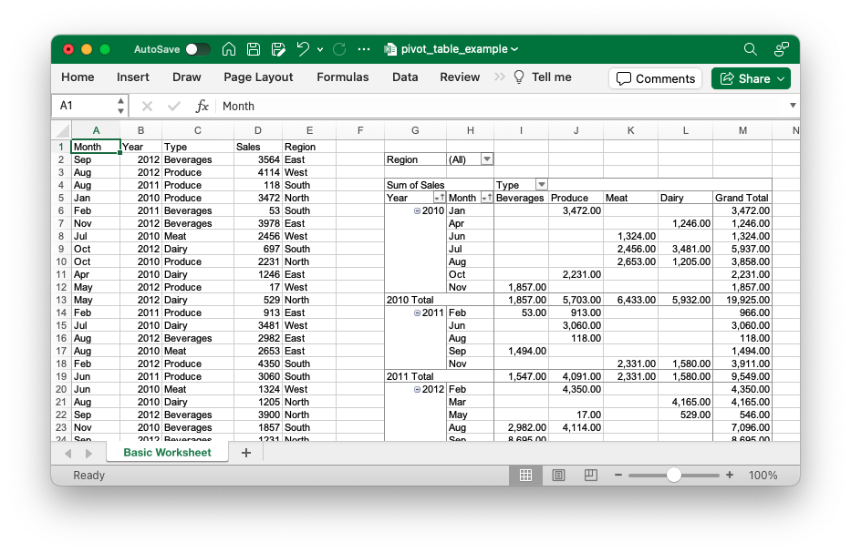

## Description

Pivot tables are cool.

## Code

```ruby
require 'axlsx'

p = Axlsx::Package.new
wb = p.workbook

wb.add_worksheet(name: 'Basic Worksheet') do |sheet|
  sheet.add_row ['Month', 'Year', 'Type', 'Sales', 'Region']

  # Generate some data
  30.times do
    sheet.add_row [
      ['Jan', 'Feb', 'Mar', 'Apr', 'May', 'Jun', 'Jul', 'Aug', 'Sep', 'Oct', 'Nov', 'Dec'].sample,
      [2010, 2011, 2012].sample,
      ['Meat', 'Dairy', 'Beverages', 'Produce'].sample,
      rand(5000),
      ['East', 'West', 'North', 'South'].sample
    ]
  end

  sheet.add_pivot_table 'G4:L17', 'A1:E31', { sort_on_headers: ['Month'] } do |pivot_table|
    pivot_table.rows = ['Month', 'Year']
    pivot_table.columns = ['Type']
    pivot_table.data = [ref: 'Sales', num_fmt: 4]
    pivot_table.pages = ['Region']
  end
end

p.serialize 'pivot_table_example.xlsx'
```

## Output


