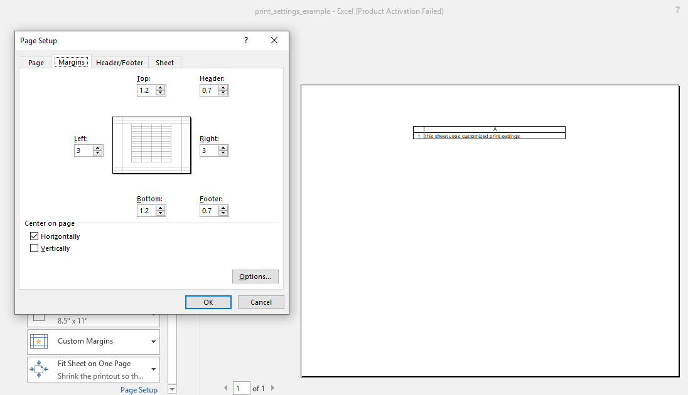

## Description

You could change the page settings for printing.

## Code

```ruby
require 'axlsx'

p = Axlsx::Package.new
wb = p.workbook

margins = {
  left: 3,
  right: 3,
  top: 1.2,
  bottom: 1.2,
  header: 0.7,
  footer: 0.7
}

setup = {
  fit_to_width: 1,
  orientation: :landscape,
  paper_width: '297mm',
  paper_height: '210mm'
}

options = {
  grid_lines: true,
  headings: true,
  horizontal_centered: true
}

wb.add_worksheet(name: 'Print settings',
                 page_margins: margins,
                 page_setup: setup,
                 print_options: options) do |sheet|
  sheet.add_row ['this sheet uses customized print settings']
end

p.serialize 'print_settings_example.xlsx'
```

## Output


