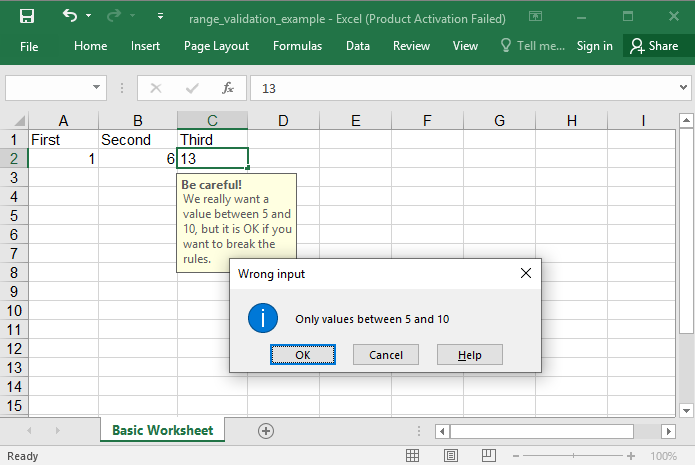

## Description

You could validate data to be between two values.

## Code

```ruby
require 'axlsx'

p = Axlsx::Package.new
wb = p.workbook

wb.add_worksheet(name: 'Basic Worksheet') do |sheet|
  sheet.add_row ['First', 'Second', 'Third']
  sheet.add_row [1, 6, 11]

  sheet.add_data_validation('A2:C2',
    type: :whole,
    operator: :between,
    formula1: '5',
    formula2: '10',
    showErrorMessage: true,
    errorTitle: 'Wrong input',
    error: 'Only values between 5 and 10',
    errorStyle: :information,
    showInputMessage: true,
    promptTitle: 'Be careful!',
    prompt: 'We really want a value between 5 and 10, but it is OK if you want to break the rules.')
end

p.serialize 'range_validation_example.xlsx'
```

## Output


