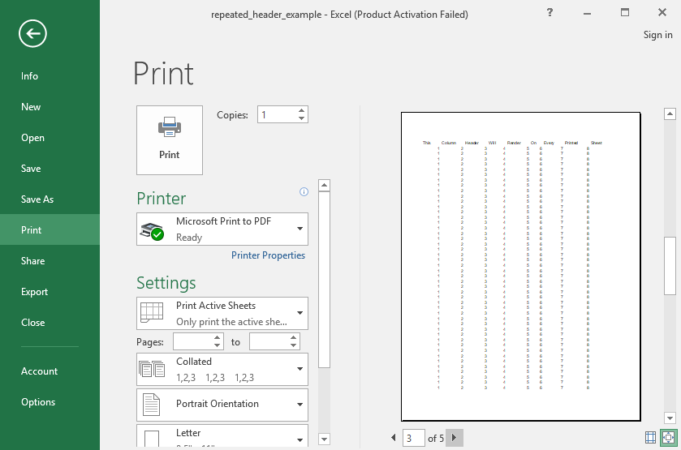

## Description

Repeat headers on print layout

## Code

```ruby
require 'axlsx'

p = Axlsx::Package.new
wb = p.workbook

wb.add_worksheet(name: 'Repeated header') do |sheet|
  sheet.add_row ['This', 'Column', 'Header', 'Will', 'Render', 'On', 'Every', 'Printed', 'Sheet']

  200.times do
    sheet.add_row [1, 2, 3, 4, 5, 6, 7, 8]
  end

  wb.add_defined_name("'repeated header'!$1:$1", local_sheet_id: sheet.index, name: '_xlnm.Print_Titles')
end

p.serialize 'repeated_header_example.xlsx'
```

## Output


