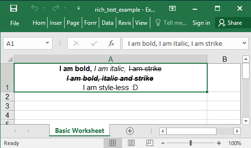

## Description

This is a very basic example with a worksheet and two rows of data.

## Code

```ruby
require 'axlsx'

p = Axlsx::Package.new
wb = p.workbook

s = wb.styles
wrap_text = s.add_style(alignment: {horizontal: :center, vertical: :center, wrap_text: true})

wb.add_worksheet(name: 'Basic Worksheet') do |sheet|
  rt = Axlsx::RichText.new
  rt.add_run('I am bold, ', b: true)
  rt.add_run('I am italic, ', i: true)
  rt.add_run('I am strike', strike: true)
  rt.add_run("\n")
  rt.add_run('I am bold, italic and strike', b: true, i: true, strike: true)
  rt.add_run("\n")
  rt.add_run('I am style-less :D')

  sheet.add_row [rt], style: wrap_text
end

p.serialize 'rich_text_example.xlsx'
```

## Output


